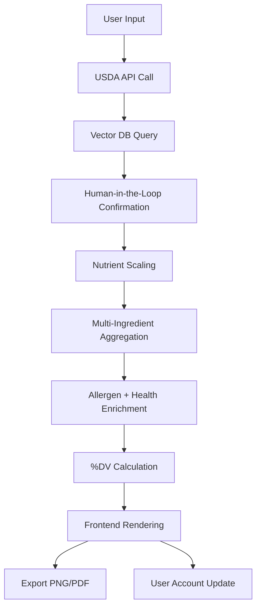

# Food Nutritional Fact Generator Agent — Complete Design & Copilot Plan

## 1. Overview

The **Nutri-Agent** is a **web-based AI agent** designed to:

- Allow users to search foods via **USDA FoodData Central API and vector database**
- Input serving sizes or custom quantities
- Generate **FDA 2020-compliant Nutrition Facts** labels, allergen flags, and health benefits
- Support **multi-ingredient recipes**, nutrient aggregation, and export as **PNG/PDF**
- Maintain **human-in-the-loop confirmations** for accuracy

**Target Users:** Nutrition-conscious consumers, dieticians, recipe developers

**Primary Deployment:** Web application (React frontend + Node.js backend)

This document combines both the **complete technical design** and **Copilot Plan Mode** for modular implementation.

---

## 2. Architecture

### 2.1 High-Level Architecture

```mermaid
flowchart TD
    A[Frontend: React Web App] -->|REST/GraphQL API| B[Backend/Agent: Node.js]
    B --> C[Database Layer: MongoDB Atlas]

    subgraph Frontend
        A1[Food search UI]
        A2[Serving size input]
        A3[Multi-ingredient UI]
        A4[Nutrition Facts view]
        A5[User favorites & daily intake]
    end

    subgraph Backend/Agent
        B1[OpenAI LLM Orchestration]
        B2[USDA API Proxy]
        B3[Vector DB Queries]
        B4[Nutrient Calculation]
        B5[Allergen & Health Module]
        B6[Export Rendering (PNG/PDF)]
    end

    subgraph Database
        C1[Foods (USDA + embeddings)]
        C2[Nutrients Reference]
        C3[Recipes (user multi-ingredient)]
        C4[Users & History]
    end
``` 

### 2.2 Key Components

| Component | Purpose | Tech/Tools |
|-----------|--------|------------|
| Frontend UI | Food search, serving size input, recipe builder, Nutrition Facts rendering | React, SVG/Canvas, html2canvas |
| Backend Agent | Orchestrates API calls, vector DB queries, LLM reasoning, nutrient aggregation | Node.js, OpenAI SDK |
| Vector DB | Stores USDA food embeddings, supports semantic search | MongoDB Atlas Vector Search |
| USDA API Proxy | Handles food data lookup | Node.js REST API |
| Nutrient Calculator | Scales nutrients by serving size, aggregates multi-ingredient | Node.js |
| Allergen & Health Module | Hybrid mapping + LLM-generated health benefits | Node.js + OpenAI |
| Export Renderer | Generates PNG / PDF for FDA labels | Puppeteer / PDFKit |
| User Management | Authentication, favorites, daily intake tracking | MongoDB Atlas, JWT Auth |

---

## 3. Data Model

### 3.1 Foods Collection
```json
{
  "fdcId": 12345,
  "name": "Avocado",
  "servingSize": 100,
  "unit": "g",
  "nutrients": {...},
  "allergens": ["—"],
  "healthBenefits": ["Supports heart health", "Rich in fiber"]
}
```

### 3.2 Recipes Collection
```json
{
  "userId": "abc123",
  "recipeName": "Avocado Toast",
  "ingredients": [{"fdcId": 12345, "servingSize": 50}],
  "aggregatedNutrients": {...},
  "allergens": ["gluten"]
}
```

### 3.3 Users Collection
```json
{
  "userId": "abc123",
  "name": "John Doe",
  "email": "john@example.com",
  "favorites": [12345, 67890],
  "dailyIntake": [...],
  "createdAt": "2026-02-24T12:00:00Z"
}
```

---

## 4. Agent Workflow



---

## 5. Nutrient Calculation Logic

```text
For each ingredient:
  nutrient_value_scaled = (usda_per_100g / 100) * serving_size_g

For multi-ingredient recipes:
  aggregated_nutrient = sum(nutrient_value_scaled for all ingredients)

%DV = (aggregated_nutrient / DV_reference) * 100
```

---

## 6. Error Handling & Recovery

- No results found → suggest nearest foods from vector DB
- Missing nutrient data → show “—” or 0
- Invalid serving size → prompt user correction
- API rate limit exceeded → queue requests / notify user
- Ambiguous ingredients → ask user for confirmation / substitutes

---

## 7. Export Pipeline

- **PNG:** Client-side html2canvas + optional server-side verification
- **PDF:** Puppeteer / PDFKit server-side
- FDA Compliance: mandatory nutrients at top, optional nutrients secondary
- Filename format: `recipeName_date.png/pdf`

---

## 8. Tech Stack

| Layer | Tech / Tools |
|-------|--------------|
| Frontend | React, SVG/Canvas, html2canvas |
| Backend | Node.js, Express/NestJS |
| AI Agent | OpenAI LLM, tool-calling, hybrid mapping |
| Vector DB | MongoDB Atlas Vector Search |
| API | USDA FoodData Central (REST API) |
| Export | Puppeteer / PDFKit |
| Auth & Users | JWT, MongoDB Atlas |

---

## 9. Copilot Plan Mode Design

### Phase 1: API Layer
**Components / Classes:**
- USDAApiService: `searchFood(query)`, `getFoodDetails(fdcId)`
- VectorSearchService: `findClosestMatch(query)`, `getEmbeddings(foodName)`
- NutrientCalculator: `scaleNutrients(food, servingSize)`, `aggregateIngredients(ingredients)`
- AllergenHealthService: `mapAllergens(food)`, `generateHealthBenefits(food)`
- ExportService: `generatePNG(nutritionFacts)`, `generatePDF(nutritionFacts)`
- UserService: `saveFavorites()`, `updateDailyIntake()`, `getUserRecipes()`

### Phase 2: Database Layer
**Collections:**
- Foods
- Nutrients
- Recipes
- Users
- Embeddings

### Phase 3: Web Layer
**Components / Classes:**
- FoodSearchComponent
- ServingSizeInputComponent
- RecipeBuilderComponent
- NutritionFactsDisplayComponent
- ExportComponent
- UserDashboardComponent

**Design Guidelines:**
- Keep components **small, testable, modular**
- Build in **short phases**: API → DB → Web
- Start with single-ingredient support if needed, extend to multi-ingredient
- Maintain **human-in-the-loop confirmations**
- Ensure **FDA compliance** and **error recovery**

---

*End of Combined Complete Design & Copilot Plan*

